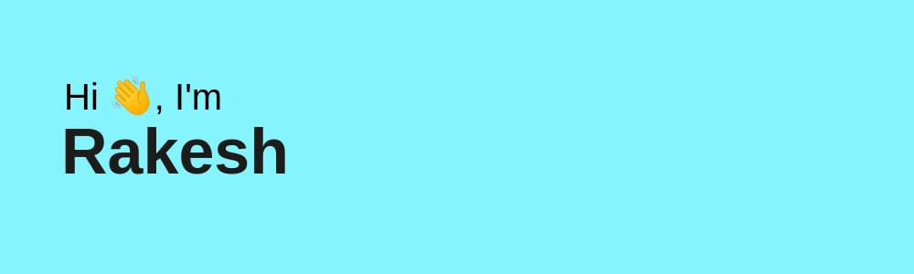

<h1 align="center"><code>Hi there 👋</code></h1>

<!-- </img> -->

  
  
  
  

### 🛠️ Languages & Tools

&nbsp;
&nbsp;
&nbsp;
&nbsp;
&nbsp;
&nbsp;
&nbsp;
&nbsp;
&nbsp;
&nbsp;
&nbsp;
&nbsp;
&nbsp;
&nbsp;

&nbsp;
&nbsp;
&nbsp;
&nbsp;

&nbsp;
&nbsp;
&nbsp;
&nbsp;
&nbsp;
&nbsp;
&nbsp;
&nbsp;

<!-- &nbsp; -->

### 🚀&nbsp; Stats

<!-- 

  

 -->

  

  

<!--  -->

<!-- 🌱 **Currently Focused** -->
<!--START_SECTION:waka-->

<!--END_SECTION:waka-->

---

<h3 align="left">📊&nbsp;Repo Status</h3>

  

